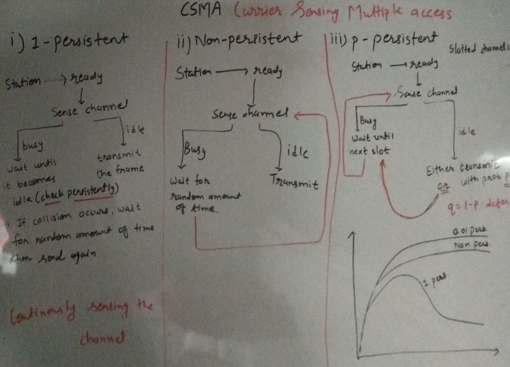
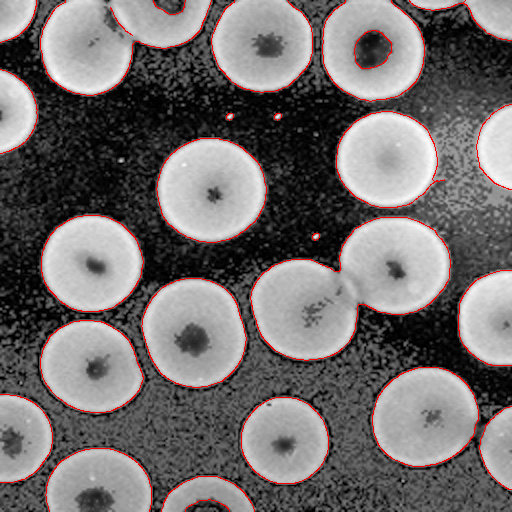
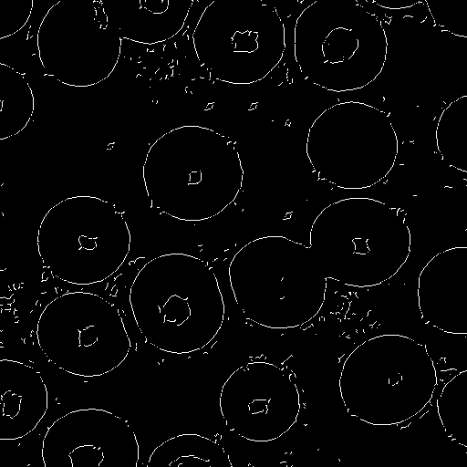
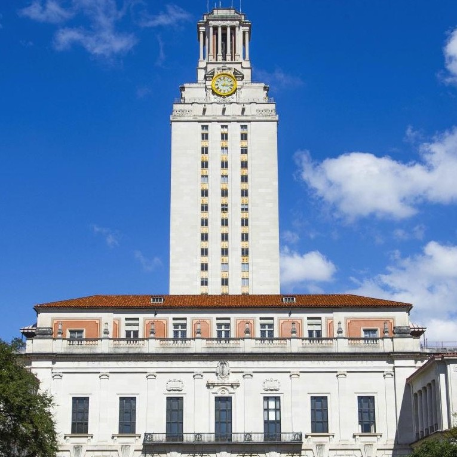

# Ancient Secrets of Computer Vision (University of Washington)

## Introduction

- These are solved assignments of [Computer Vision course taught at *University of Washington*](https://pjreddie.com/courses/computer-vision/) by *Joseph Redmon* - the author of [YOLO](https://arxiv.org/abs/1506.02640) algorithm for Object Detection. Course videos are [here](https://www.youtube.com/playlist?list=PLjMXczUzEYcHvw5YYSU92WrY8IwhTuq7p). Homework assignments are listed on aforementioned course website.

- I loved this course. The course assignments **aimed to help build a basic Computer Vision library from scratch in C language**, whose features can also be utilized in Python. 

- All the assignments are posted on GitHub repo by the author (link on course website). I have not updated individual READMEs as they are very detailed and nicely written.

## Assignment Structure

### [HW0: Image Basics](./vision-hw0/)

- Develop a data structure to represent images.
- Access and update pixel values at a given location.
- Copy image data (deep copy).
- Increment specified channel intensities by a given amount.
- Clamp image intensity values such that its in the valid range.
- Changing colorspaces. RGB to HSV and vice-versa.

### [HW1: Low Level Vision](./vision-hw1/)

- Resize images using Nearest Neighbor and Bilinear interpolation techniques.
- Implement image filters by convolving (rather cross correlation) the image with various kernels. Try different kernels to perform blurring (average and Gaussian), sharpening and embossing.
- Create hybrid images. A hybrid image looks diffrent when seen from close distances and long distances.
- Calculate image gradients with Sobel filter. Visualize gradient magnitude and direction in a RGB image.

### [HW2: Mid Level Vision](./vision-hw2/)

- Implement Harris Corner Detector to locate interest-points/keypoints in the image.
- Calculate feature descriptors for each keypoint, which describes the local neighborhood around itself.
- Match keypoints of two different images by comparing their descriptors. Filter out the false matches.
- Robustly estimate the homography between two images using matches calculated from previous step. Implement RANSAC algorithm to achieve the same.
- Stitch two images based on above computed homography.

### [HW3: Optical Flow](./vision-hw3/)

- Compute integral image.
- Implement Lucas-Kanade Dense Optical Flow algorithm.

### [HW4: High Level Vision (Feedforward Neural Nets)](./vision-hw4/)

- Implement activation function.
- Perform forward pass calculations.
- Develop backward propagation algorithm to update weights in order to classify images.
- Experiment above developed neural net with MNIST and CIFAR-10 dataset.

### [HW5: High Level Vision with PyTorch (Convolutional Neural Nets)](./vision-hw5/)

- Implement and train feedforward neural net with 0 hidden layers to classify digits (MNIST).
- Update the aforementioned with multiple hidden layers and train it again.
- Develop Convolutional Neural Net and experiment with same dataset.
- Implement data augmentation techniques to create a robust classifiers.
- Try different loss functions.

## Extraneous

I have extended this library to include the following. Below features are added to *vision-hw4/* directory as it contain all library files. I hope to add more CV techniques and algorithms to this library :)

1. Implement **Local Binary Histogram Patterns** - a feature extraction algorithm.
2. Develop **Histogram Oriented Gradients** - a feature extraction algorithm.
3. Apply **Projective Transform** on input image.

    Given below input image and four corner point coordinates,
    | Input Image | Output Image |
    |-|-|
    |  |  |
   

4. Implement **Canny edge detector**.

    | Input Image | Output |
    |-|-|
    |  |  |

5. **Detect lines** using Hough Transform.

    | Input Image |  |
    |-|-|
    | Edge Detection Output |  |
    | Detected Lines |  |

6. **Detecting circles** using Hough Transform.

    | Input Image |  |
    |-|-|
    | Edge Detection Output |  |
    | Detected Circles |  |

