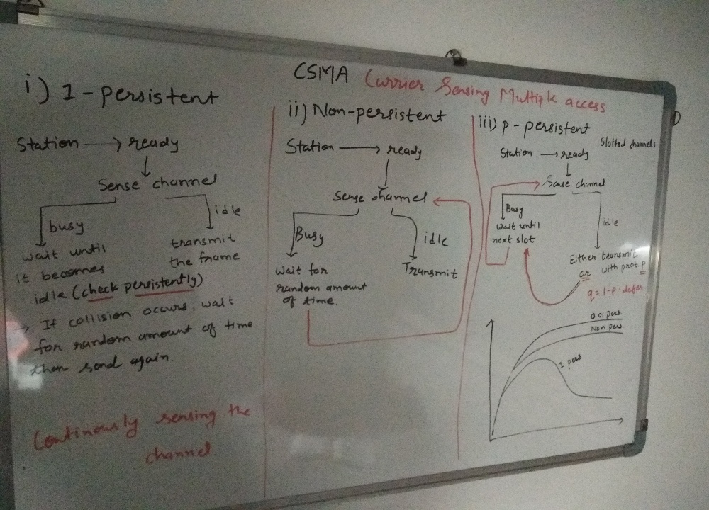
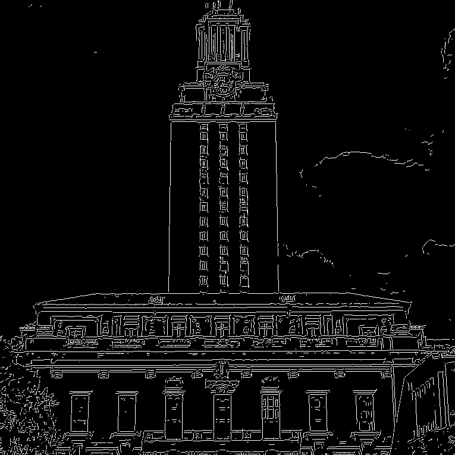
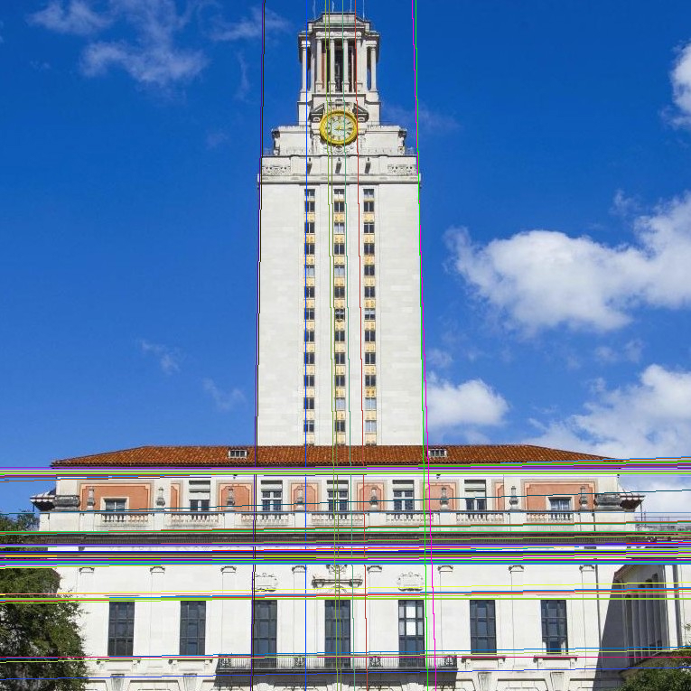

## Introduction to Computer Vision (University of Washington)

These are assignments (*with solution of course*) for [*computer vision* course, taught at *University of Washington*](https://pjreddie.com/courses/computer-vision/) by excellent instructor *Joseph Redmon*. Course videos are [here](https://www.youtube.com/playlist?list=PLjMXczUzEYcHvw5YYSU92WrY8IwhTuq7p). You can take a look at homework assignments at given course link. I have solved all the assignments.

*I suggest you watch videos, then try to solve it by yourself, if you can't then only take a look here.*

I loved this course. Assignments are about to build an **image processing library in C language** from scratch (*nearly*), which then can be used in *Python*; Just like how *OPENCV* is build. All the functionalities has to be developed by us. There are tons of computer vision (*not advanced vision stuff*) techniques out there, of course not all of them are covered here. Hence that is the reason for uploading all this, I will be adding (extending this library) other computer vision algorithms here. 

*Till now, I have implemented these three algorithms (Not covered in assignments)*,
* Local Binary Histogram Patterns (feature extraction): I referred to [this article](https://towardsdatascience.com/face-recognition-how-lbph-works-90ec258c3d6b) to understand lbph.
* Histogram Oriented Gradients (feature extraction): I referred to [this article](https://www.learnopencv.com/histogram-of-oriented-gradients/) to understand hog.
* Apply projective transform on image. For example,

given this input image and four corner point coordinates,

generate this output image

* Canny edge detection (shown in below figures, input image then output image),

* Detecting lines using Hough Transform (input image, edge detected image, output image).

* Detecting circles using Hough Transform (input image, edge detected image, output image).

---
#### Note
* All these new stuff will be added inside *vision-hw4/* directory.
* About how to *make* and use this functionalities (not newer ones), is explained in README of *vision-hw0/* directory.
* For code of new techniques, look at *vision-hw4/src/image.h* file (function definition).
---

 
 
 

*In future, I hope to add (if time permits) more CV algorithms and techniques here* :)
